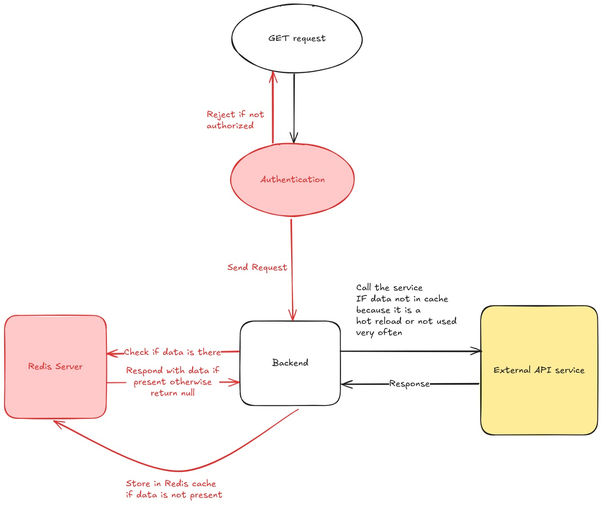

# Currency Exchange Rate API

[](https://spring.io/projects/spring-boot)
[](https://www.java.com)
[](LICENSE)

A professional Spring Boot backend API for currency exchange rate. Fetches real-time rates from an external API, with planned caching and conversion features.

## Features

- **Exchange Rate Lookup**: Get current rate between two currencies (e.g., USD to EUR) - ✅ Implemented.
- **Currency Conversion**: Convert amounts between currencies (planned).
- **Supported Currencies List**: List available currencies (planned).
- **Caching**: Redis-based cache-aside pattern for performance (planned).
- **Error Handling**: Graceful fallbacks for API failures - ✅ Basic implementation.
- **MVP Focus**: No authentication for initial version; JWT planned.

## Tech Stack

- **Backend**: Spring Boot 3.5.5 (Web, Data JPA, Validation)
- **Database**: H2 (dev), MySQL-ready for prod
- **Caching**: Redis
- **External API**: [fawazahmed0/exchange-api](https://github.com/fawazahmed0/exchange-api) (open source, no key needed)
- **Tools**: Maven, RestClient for API calls, Lombok for boilerplate reduction

## Prerequisites

- Java 17+
- Maven 3.6+
- Redis server (for caching features, install via `brew install redis` or similar)
- Optional: Docker for containerization (future)

## Setup and Installation

1. **Clone the Repository**:
   ```bash
   git clone https://github.com/yourusername/currency-exchange-api.git
   cd currency-exchange-api/backend
   ```

2. **Build the Project**:
   ```bash
   mvn clean install
   ```

3. **Run the Application**:
   ```bash
   mvn spring-boot:run
   ```
   - Or use the script: `./run.sh`
   - App runs on `http://localhost:8080`

4. **Run Tests**:
   ```bash
   mvn test
   ```

## Usage

### Endpoints
- **GET /api/v1/check**: Health check - returns "All good." - ✅ Implemented.
- **GET /api/v1/rates/{from}/{to}**: Get exchange rate (e.g., `/rates/usd/eur`) - ✅ Implemented.
  - Response: JSON with date, rate, cached status.
- **GET /api/v1/convert?from={from}&to={to}&amount={amount}**: Convert currency amount (planned).
- **GET /api/v1/currencies**: List supported currencies (planned).

Example:
```bash
curl http://localhost:8080/api/v1/rates/usd/eur
```

Response:
```json
{
  "basecurrency": "usd",
  "targetcurrency": "eur",
  "rate": 0.8456,
  "date": "2024-03-06",
  "inCache": false
}
```

## Architecture Overview

- **MVC Pattern**: Controllers handle requests, Services manage business logic (API calls, parsing), DTOs for data transfer - ✅ Implemented.
- **Flow**: Request → Controller → Service (fetch/parse external API) → Response DTO - ✅ Implemented for rates endpoint.
- **Caching**: Cache-aside with Redis for rates (planned).
- **Error Handling**: Basic implementation with HTTP status mapping - ✅ Implemented.



## Future Improvements

### Core API Enhancements
- **Currency Conversion**: `GET /api/v1/convert?from=USD&to=EUR&amount=100` - Calculate converted amounts.
- **Currencies List**: `GET /api/v1/currencies` - Return supported currencies.
- **Redis Caching**: Implement cache-aside pattern for performance optimization.

### Advanced Features
- **JWT Authentication**: Secure endpoints with token-based auth.
- **Error Handling**: Enhanced fallback mechanisms and custom exceptions.
- **API Documentation**: Swagger/OpenAPI integration for interactive docs.

### Production Readiness
- **Monitoring**: Spring Boot Actuator metrics and health checks.
- **Testing**: Unit and integration test coverage.
- **Deployment**: Docker containerization and cloud deployment.


